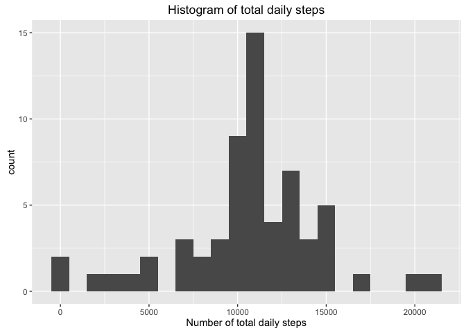

# Reproducible Research: Peer Assessment 1
## Load libraries

```r
suppressPackageStartupMessages({
  require(dplyr)
  require(data.table)
  require(lubridate)
  require(ggplot2)
  })
```

## Loading and preprocessing the data
Read in data from activity.csv  
Convert interval as this is an integer but represents time  
For example, 2355 is actually 23 hours 55 minutes  
The time value is a decimal because getting this as just a time  
rather than a date was really difficult and I spent more time on that  
than the rest of the project and I am really interested to see  
if/how anyone else solved that problem  

```r
stepData <- fread('activity.csv')
print(stepData)
```

```
##        steps       date interval
##     1:    NA 2012-10-01        0
##     2:    NA 2012-10-01        5
##     3:    NA 2012-10-01       10
##     4:    NA 2012-10-01       15
##     5:    NA 2012-10-01       20
##    ---                          
## 17564:    NA 2012-11-30     2335
## 17565:    NA 2012-11-30     2340
## 17566:    NA 2012-11-30     2345
## 17567:    NA 2012-11-30     2350
## 17568:    NA 2012-11-30     2355
```

```r
stepData <- mutate(stepData, date = ymd(date)) %>%
              mutate(hours = floor(interval/100)) %>%
              mutate(minutes = interval - hours*100) %>%
              mutate(time_str = sprintf('%02d:%02d:00', hours, minutes)) %>%
              mutate(time_val = hours + minutes/60)
```

## What is mean total number of steps taken per day?
Calculate mean and median number of steps per day  
when NA values are removed from the calculation  
For histogram, bin size selected as 1,000 steps as this seems a standard unit of steps  


```r
stepsDaily <- group_by(stepData, date) %>%
                summarise(total_steps = sum(steps, na.rm=TRUE))

mean(stepsDaily$total_steps)
```

```
## [1] 9354.23
```

```r
median(stepsDaily$total_steps)
```

```
## [1] 10395
```

```r
qplot(total_steps,
      data = stepsDaily,
      geom = 'histogram',
      main = 'Histogram of total daily steps',
      xlab = 'Number of total daily steps',
      binwidth = 1000
     )
```

<!-- -->

## What is the average daily activity pattern?
Calculate mean and median number of steps at each time interval  
and show histogram.  
Note that NA values are removed from the calculation  

```r
stepPattern <- group_by(stepData, time_val) %>%
                 summarise(avg = mean(steps, na.rm=TRUE))

qplot(time_val,
      avg,
      data = stepPattern,
      geom = 'line',
      main = 'Average Daily Activity Pattern',
      xlab = 'Hour of Day',
      ylab = 'Number of steps in 5 minute period'
     )
```

<!-- -->

```r
idx <- order(stepPattern$avg,decreasing=TRUE)
time_of_max_steps <- as.numeric(stepPattern[idx[1], 'time_val'])
hour_of_max_steps <- floor(time_of_max_steps)
minute_of_max_steps <- ( time_of_max_steps - hour_of_max_steps ) * 60
cat('Max steps occurred in interval starting ', hour_of_max_steps, ':', minute_of_max_steps, sep='')
```

```
## Max steps occurred in interval starting 8:35
```

## Imputing missing values
There are 2,304 missing values.  

```r
sum(is.na(stepData$steps))
```

```
## [1] 2304
```
For these, use the mean value of the 5 minute period  
by merging with the stepPattern data

```r
stepData <- merge( stepData, stepPattern, by='time_val' ) %>%
              arrange( date, time_val ) %>%
              mutate( steps = ifelse( is.na(steps), avg, steps ) ) %>%
              select( steps, date, time_val )
```
Re-calculate mean and median number of steps per day  
and show histogram.  
Note that NA values have been imputed.  

```r
stepsDaily <- group_by(stepData, date) %>%
                summarise(total_steps = sum(steps, na.rm=TRUE))

mean(stepsDaily$total_steps)
```

```
## [1] 10766.19
```

```r
median(stepsDaily$total_steps)
```

```
## [1] 10766.19
```

```r
qplot(total_steps,
      data = stepsDaily,
      geom = 'histogram',
      main = 'Histogram of total daily steps',
      xlab = 'Number of total daily steps',
      binwidth = 1000
     )
```

<!-- -->

The mean and median have both increased and are now the same  
There is still a day where there is no steps which should be investigated.  

## Are there differences in activity patterns between weekdays and weekends?  
Well, it looks like we get up later on the weekends.  

```r
dtype <- function(x) {
  ifelse( wday(x) %in% c(1, 7), 'weekend', 'weekday' )
}

dayTypeSummary <- mutate( stepData, daytype = as.factor(dtype(date) ) ) %>%
                    group_by( time_val, daytype ) %>%
                    summarise( avg = mean(steps) )
       
qplot(time_val,
      avg,
      data   = dayTypeSummary,
      geom   = 'line',
      facets = daytype ~ .,
      xlab   = 'Hour of Day',
      ylab   = 'Number of steps in 5 minute period'
     )
```

<!-- -->

Given the difference in weekday to weekend activity, the imputation  
approach could be changed to reflect this.  
