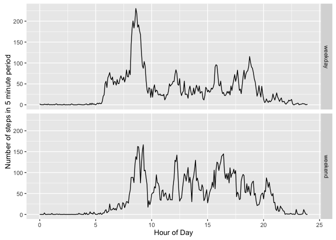

# Reproducible Research: Peer Assessment 1
## Load libraries

```r
library(dplyr, quietly=TRUE)
```

```
## Warning: package 'dplyr' was built under R version 3.2.5
```

```
## 
## Attaching package: 'dplyr'
```

```
## The following objects are masked from 'package:stats':
## 
##     filter, lag
```

```
## The following objects are masked from 'package:base':
## 
##     intersect, setdiff, setequal, union
```

```r
library(data.table, quietly=TRUE)
```

```
## Warning: package 'data.table' was built under R version 3.2.5
```

```
## -------------------------------------------------------------------------
```

```
## data.table + dplyr code now lives in dtplyr.
## Please library(dtplyr)!
```

```
## -------------------------------------------------------------------------
```

```
## 
## Attaching package: 'data.table'
```

```
## The following objects are masked from 'package:dplyr':
## 
##     between, last
```

```r
library(ggplot2,quietly=TRUE)
library(lubridate, quietly=TRUE)
```

```
## 
## Attaching package: 'lubridate'
```

```
## The following objects are masked from 'package:data.table':
## 
##     hour, mday, month, quarter, wday, week, yday, year
```

## Loading and preprocessing the data
Use dplyr package
Convert dates from character to POSIXt


```r
# Maybe should read the zip file
x <- fread('activity.csv') %>%
       mutate(date = ymd(date))
```

## What is mean total number of steps taken per day?

```r
mean(x$steps, na.rm=TRUE)
```

```
## [1] 37.3826
```

```r
median(x$steps, na.rm=TRUE)
```

```
## [1] 0
```

```r
hist(x$steps)
```

<!-- -->

## What is the average daily activity pattern?

```r
y <- group_by(x, interval) %>%
       summarise(avg = mean(steps, na.rm=TRUE))
qplot(interval,
      avg,
      data = y,
      geom = 'line',
      main = 'Average Daily Activity Pattern'
     )
```

<!-- -->

```r
y[order(y$avg,decreasing=TRUE)[1],'interval']
```

```
## Source: local data frame [1 x 1]
## 
##   interval
##      <int>
## 1      835
```

## Imputing missing values
Use the mean value of the 5 minute period
Won't change the mean (assuming equal number of 5 min periods)
May change the median


```r
sum(is.na(x$steps))
```

```
## [1] 2304
```

```r
z <- merge(x, y, by='interval') %>%
       arrange(date, interval) %>%
       mutate(steps = ifelse(is.na(steps), avg, steps)) %>%
       select(steps, date, interval)
hist(z$steps)
```

<!-- -->

```r
mean(z$steps)
```

```
## [1] 37.3826
```

```r
median(z$steps)
```

```
## [1] 0
```

## Are there differences in activity patterns between weekdays and weekends?

```r
dtype <- function(x) {
  ifelse(wday(x) %in% c(1, 7), 'weekend', 'weekday')
}

zz <- mutate(z, daytype = as.factor(dtype(date) ) ) %>%
        group_by(interval, daytype) %>%
        summarise(avg = mean(steps))
       
qplot(interval,
      avg,
      data = zz,
      geom = 'line',
      facets = daytype ~ .
     )
```

<!-- -->
